# 用臉部肌電圖做中文無聲語音辨識

**Neural Chinese Silent Speech Recognition with Facial EMG**

Xie et al., 2025 ｜ Speech Communication

<div class="pt-12 text-gray-300">
  整理：陳睿莆　國立虎尾科技大學
</div>

---
layout: default
---

# 目錄

<div class="grid grid-cols-2 gap-4 mt-4">
<div>

**研究背景**
- 一、什麼是無聲語音介面（SSI）
- 二、為什麼用臉部 sEMG
- 三、研究動機與挑戰

**資料集與硬體**
- 四、資料集介紹
- 五、硬體設備
- 六、電極擺放位置

**訊號前處理**
- 七、為什麼需要濾波
- 八、Butterworth 濾波器
- 九、Notch 陷波濾波器

</div>
<div>

**特徵萃取與增強**
- 十、MFSC 特徵萃取
- 十一～十四、資料增強三種方法

**模型架構（AuxCEMGR）**
- 十五～二十一、CNN / Transformer / CTC / GRL

**訓練與評估**
- 二十二～二十四、訓練設定與 CER

**實驗結果**
- 二十五～三十一、各項分析

**結論**
- 三十二～三十四

</div>
</div>

---
layout: two-cols
---

# 一、什麼是無聲語音介面（SSI）？

<br>

**定義**：不發出聲音，靠感測器辨識說話意圖 → 轉成文字

<br>

**應用場景**
- 喉嚨受傷者、氣管切開術後無法發聲的病人
- 高噪音環境（工廠、戰場）
- 隱密通訊（不希望他人聽到內容）

<br>

**為什麼難？**
- 靜默 EMG 訊號比有聲弱 **3–5 倍**，訊雜比（SNR）低
- 中文字元龐大（本研究 **667 個**唯一字元）
- 每次貼電極位置略不同 → 訊號分布偏移（Session Drift）

::right::

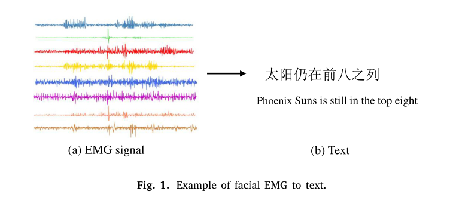

<div class="text-sm text-gray-400 mt-2 text-center">Fig.1 — EMG 訊號轉文字示意圖</div>

---
layout: two-cols
---

# 二、為什麼用臉部 sEMG？

<br>

**sEMG（表面肌電圖）**
- 貼在皮膚表面的電極，偵測肌肉收縮時的微弱電訊號（0.1–5 mV）
- 非侵入式、即時、可穿戴

<br>

**為什麼臉部？**
- 說話時嘴唇、下巴、臉頰、喉部肌肉都會動
- 靜默說話時，肌肉仍有微小收縮，可被偵測

<br>

**與其他 SSI 技術的比較**
- 喉部麥克風：需靠聲帶振動，完全靜默時無效
- 腦電圖（EEG）：解析度低、個體差異大
- **臉部 sEMG：輕便、準確、可長時間佩戴** ✓

::right::

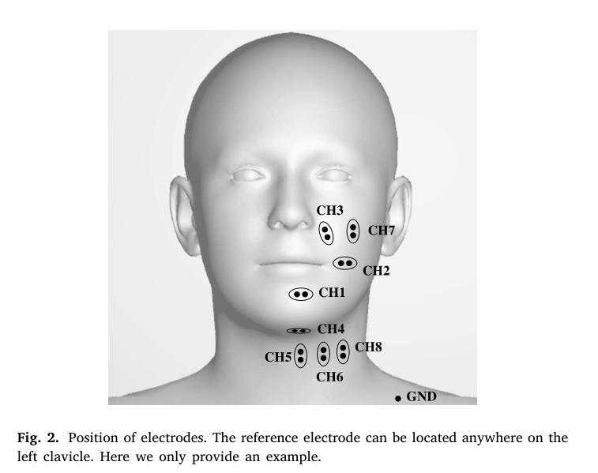

<div class="text-sm text-gray-400 mt-2 text-center">Fig.2 — 電極擺放位置</div>

---

# 三、研究動機與挑戰

<div class="grid grid-cols-2 gap-6 mt-4">
<div>

**現有研究的空白**
- 現有 sEMG 語音辨識大多針對英文
- 中文 SSI 研究幾乎空白，**本文為首篇**

**中文的特殊挑戰**
- 字元空間龐大：**667 個**唯一字元
- 聲調系統複雜：4 個聲調 + 輕聲
- 同音字多：「ji」→ 雞、機、積…

</div>
<div>

**Session 偏移問題（Domain Shift）**

```
Session 1: 電極貼在位置 A → 特徵分布 P₁
Session 2: 電極貼在位置 B → 特徵分布 P₂
         ↓
P₁ ≠ P₂ → 跨 Session 準確率大幅下降
```

**本研究目標**
- 設計能克服以上挑戰的
- **第一個**中文臉部 EMG SSI 系統

</div>
</div>

---
layout: two-cols
---

# 四、資料集介紹

<br>

| 項目 | 數值 |
|------|------|
| 受試者 | 1 名成年女性 |
| 語料庫 | NBA 籃球播報語料 |
| 句子數 | 1,238 句 |
| 總字元數 | 12,584 字 |
| 唯一字元 | 667 個 |
| Session 數 | 5 個（不同日期） |
| 資料分割 | 訓練:驗證:測試 = 7:1:2 |

<br>

**Session 設計**
- 每 Session 重新佩戴電極
- 訓練 Session 1-3，測試 Session 4-5（跨 Session）

::right::

<br><br>

**為什麼只有 1 名受試者？**

EMG 資料採集成本高、需要志願者長時間配合，這是當前 SSI 研究的普遍限制。

<br>

**NBA 語料庫的特點**
- 涵蓋日常用語與體育專有名詞
- 句子長度 5–35 字不等
- 字元分布真實，不人工簡化

---
layout: two-cols
---

# 五、硬體設備 & 電極位置

<br>

**Neuracle NSW308M**

| 規格 | 數值 |
|------|------|
| 採樣率 | 1000 Hz |
| 通道數 | 8 通道 |
| 電極材質 | Ag/AgCl |
| 訊號振幅 | 0.1–5 mV |

<br>

**電極位置**
- CH1–CH2：上嘴唇兩側（口輪匝肌）
- CH3–CH4：下巴左右（**CH4 最重要**）
- CH5–CH6：喉部（靜默時幾乎不動）
- CH7–CH8：臉頰（顴大肌）

::right::


<div class="text-sm text-gray-400 mt-2 text-center">Fig.2 — 8 通道電極擺放</div>

---

# 六、訊號前處理流程

<div class="grid grid-cols-3 gap-4 mt-6">
<div class="border rounded p-4 bg-blue-50">

**① Butterworth 帶通濾波**

保留 **10–400 Hz**

- 去除 < 10 Hz 的基線漂移
- 去除 > 400 Hz 的高頻噪訊
- 4 階（截止斜率夠銳利）

```python
from scipy.signal import butter, filtfilt
b, a = butter(4, [10, 400],
    btype='band', fs=1000)
x = filtfilt(b, a, raw_signal)
```

</div>
<div class="border rounded p-4 bg-orange-50">

**② Notch 陷波濾波**

去除 **50/150/250/350 Hz**

- 50 Hz：台灣市電工頻
- 150/250/350 Hz：諧波
- Q=30：陷波夠窄夠精準

```python
from scipy.signal import iirnotch
for f0 in [50, 150, 250, 350]:
    b, a = iirnotch(f0, Q=30,
                    fs=1000)
    x = filtfilt(b, a, x)
```

</div>
<div class="border rounded p-4 bg-green-50">

**③ 分段切割**

依句子邊界切成片段

- 每段對應一句話
- 保留原始時序長度
- 用於後續 MFSC 計算

</div>
</div>

---
layout: two-cols
---

# 七、MFSC 特徵萃取

<br>

**為什麼要做特徵萃取？**
- 原始訊號：1000 pt/秒 × 8 通道 = 8000 維/秒
- 大量點是冗餘的，且包含與語音無關的成分

<br>

**Mel 尺度的直覺**

人耳對低頻分辨力強、對高頻弱 → Mel 尺度模仿此特性

<br>

**計算步驟**
1. **分窗**：Hanning 窗，25 ms，移位 10 ms
2. **FFT**：時域 → 頻域（功率頻譜）
3. **36 個 Mel 濾波器**：計算各頻帶能量
4. **取對數**：模仿人耳感知，壓縮動態範圍

**輸出**：8 通道 × T 時步 × **36 維**

::right::

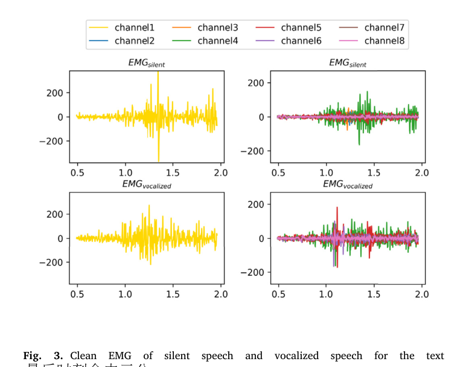

<div class="text-sm text-gray-400 mt-2 text-center">Fig.3 — 靜默 vs 有聲 EMG 波形比較</div>

---

# 八、資料增強 — 為什麼需要？

<div class="grid grid-cols-3 gap-4 mt-6">
<div class="border-l-4 border-red-400 pl-4">

**問題①：資料量少**

只有 1 名受試者，1,238 句

→ 模型容易過擬合

</div>
<div class="border-l-4 border-yellow-400 pl-4">

**問題②：Session 偏移**

每次重貼電極位置不同

→ 訊號分布偏移（Domain Shift）

</div>
<div class="border-l-4 border-blue-400 pl-4">

**問題③：訊號微弱**

靜默 EMG 振幅僅有聲的 1/3–1/5

→ 訊雜比低，特徵不清晰

</div>
</div>

<br>

**三種資料增強的解決策略**

| # | 方法 | 解決的問題 | 效果 |
|---|------|-----------|------|
| ① | 頻譜相減 | 降低背景噪訊 | Baseline CER 66.5%→53.9% |
| ② | 有聲 EMG 混合（γ=0.8） | 增強微弱訊號 | AuxCEMGR 額外降低 6.5% |
| ③ | Mixup（α=0.02） | 提升泛化，抑制過擬合 | 額外降低 1.5% |

---
layout: two-cols
---

# 九、資料增強① — 頻譜相減

<br>

**原理**：估計背景噪訊頻譜，從訊號中減去

<br>

**步驟**
1. 靜止時錄製背景 EMG（5 秒）
2. 計算平均背景功率頻譜 N̂(f)
3. 每個頻率點相減，結果取零下界

<br>

$$\hat{S}(f) = \max\left(X(f) - \hat{N}(f),\ 0\right)$$

- X(f)：含噪訊原始頻譜
- N̂(f)：估計背景噪訊頻譜
- Ŝ(f)：去噪後乾淨訊號頻譜

<br>

**效果**：CER **66.5% → 53.9%**（最重要的增強）

::right::

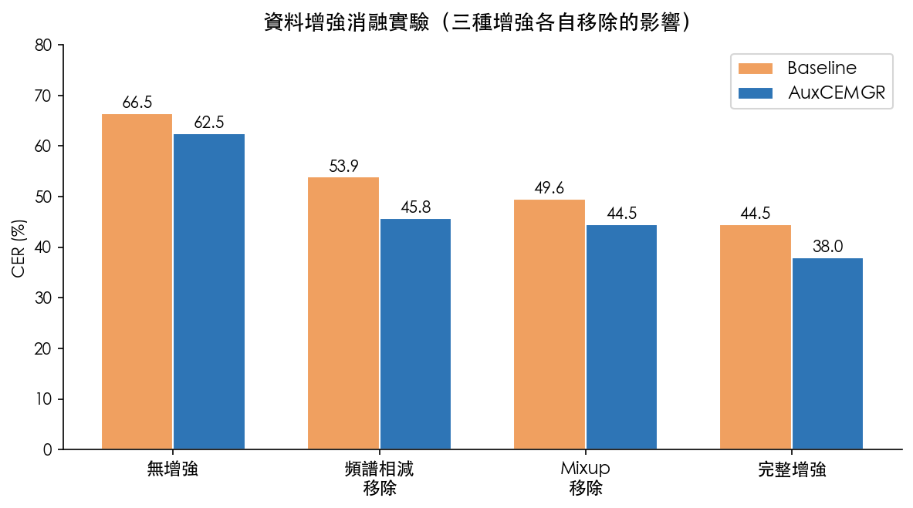

<div class="text-sm text-gray-400 mt-2 text-center">三種增強各自移除後的 CER 變化</div>

---
layout: two-cols
---

# 十、資料增強② — 有聲 EMG 混合

<br>

**動機**：有聲 EMG 訊號較強，可增強弱訊號的訓練效果

<br>

**公式**

$$x_{aug} = (1-\gamma)\cdot x_{silent} + \gamma \cdot x_{audible}$$

- γ = 0.8（最佳值，見右圖）
- γ=0：純靜默，γ=1：純有聲

<br>

**為什麼 γ=0.8 最佳？**
- γ 太小：增強效果不足
- γ=0.8：甜蜜點，足夠的訊號強度增強
- γ=1.0：訓練/測試分布差距最大，泛化差

<br>

**效果**：AuxCEMGR CER 額外降低 **6.5%**

::right::

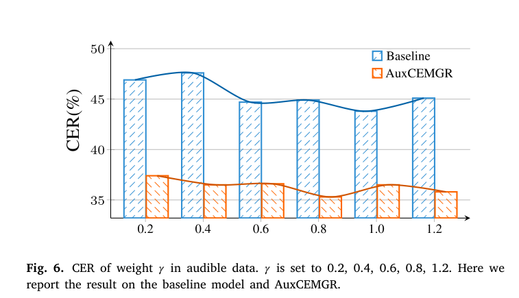

<div class="text-sm text-gray-400 mt-2 text-center">Fig.6 — γ 值對 CER 的影響</div>

---
layout: two-cols
---

# 十一、資料增強③ — Mixup

<br>

**原理**：隨機混合兩個樣本的特徵和標籤

$$\tilde{x} = \lambda x_i + (1-\lambda) x_j$$

λ 從 Beta(α, α) 分布取樣，**α = 0.02**

<br>

**α=0.02 的含義**

Beta(0.02, 0.02) 是 U 形分布，極度偏向 0 或 1

→ 大多數時候幾乎只用一個樣本，偶爾才真正混合

→ 引入輕微擾動而不破壞原始樣本

<br>

**效果**：提升泛化，額外降低 CER **~1.5%**

::right::

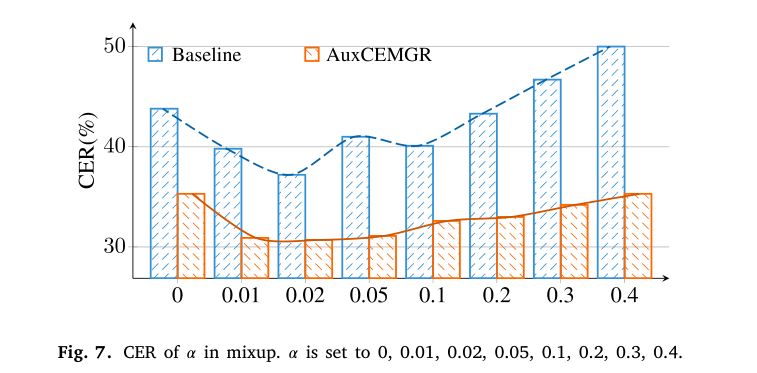

<div class="text-sm text-gray-400 mt-2 text-center">Fig.7 — α 值對 CER 的影響</div>

---

# 十二、AuxCEMGR 模型架構總覽

<br>

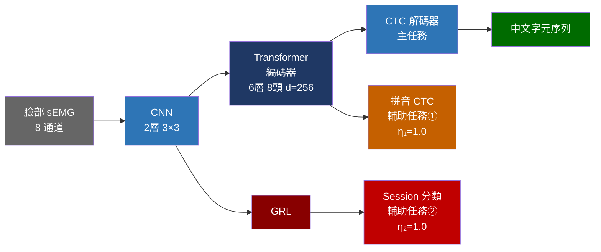

<br>

**訓練目標**：L_total = L_CTC_char + **η₁** × L_CTC_pinyin + **η₂** × L_session

---
layout: two-cols
---

# 十三、CNN + Transformer

<br>

**CNN 特徵萃取層**
- 2 層 2D 卷積，核大小 3×3，步長 2
- 每層時序壓縮一半：T → T/2 → T/4
- 輸出維度：256

<br>

**Transformer 編碼器（6層）**
- 自注意力機制：每個時步能看到整個序列
- 8 個注意力頭：8 個不同視角同時分析
- 位置編碼：告訴模型時間順序

<br>

**Transformer vs RNN 的差異**
| | Transformer | RNN/LSTM |
|--|--|--|
| 計算方式 | 並行 | 序列 |
| 長距依賴 | 強 | 弱 |
| 訓練速度 | 快 | 慢 |

::right::

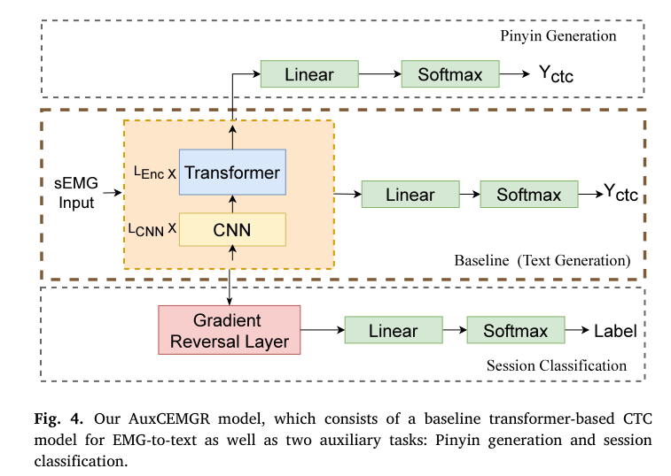

<div class="text-sm text-gray-400 mt-2 text-center">Fig.4 — AuxCEMGR 論文架構圖</div>

---

# 十四、CTC 解碼器

<div class="grid grid-cols-2 gap-6 mt-4">
<div>

**為什麼需要 CTC？**

EMG 序列長度（T≈100）≠ 文字長度（≈20）
而且沒有字元對齊標註

**CTC 解法：引入空白符號 ε**

```
模型每步輸出：某字元 or ε

輸出：你-你-好-ε-ε-世-界-界
      ↓ 折疊重複 + 移除 ε
結果：你好世界 ✓
```

**損失函數**

最大化正確序列所有可能對齊路徑的總概率

L_CTC = −log P(y|x)

</div>
<div>

**Beam Search 解碼（size=5）**

| 方法 | 說明 | 效果 |
|------|------|------|
| Greedy | 每步選最大概率 | 快但次優 |
| Beam=1 | 等同 Greedy | 同上 |
| **Beam=5** | 同時保留 5 條路徑 | **平衡最佳** |
| Beam=50 | 保留 50 條 | 慢，邊際遞減 |

**比喻**：5 個偵探同時從現場出發，最後選最合理路線

</div>
</div>

---
layout: two-cols
---

# 十五、輔助任務① — 拼音 CTC

<br>

**動機**
- 中文字元空間：667 個（學習難度大）
- 拼音音節：僅 63 種（容易學）
- 讓模型先學「怎麼發音」，再學「對應哪個字」

<br>

**做法**
- Transformer 輸出後接一個拼音 CTC 分支
- 標籤：將訓練句子轉換成拼音序列
- 損失：η₁ × L_CTC_pinyin（η₁=1.0）

<br>

**超參數搜索（Fig.5）**
- η₁, η₂ ∈ {0.1, 0.5, 1.0, 1.5, 2.0}
- 最佳組合：η₁=1.0, η₂=1.0

::right::

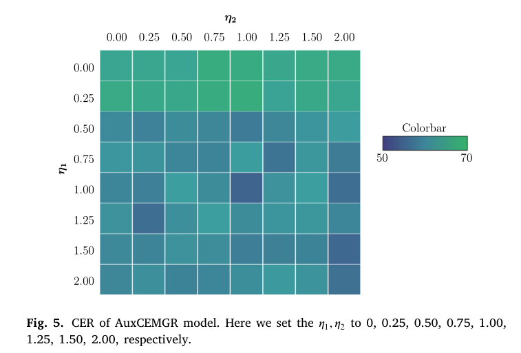

<div class="text-sm text-gray-400 mt-2 text-center">Fig.5 — η₁/η₂ 超參數熱力圖</div>

---
layout: two-cols
---

# 十六、輔助任務② — GRL + Session 分類

<br>

**問題**：5 個 Session 的特徵分布不同 → Domain Shift

**目標**：讓 CNN 學到「Session 無關」的通用特徵

<br>

**梯度反轉層（GRL）原理**

```
正向：資料原樣通過
      EMG → CNN → GRL → Session分類器
      
反向：梯度乘以 -1（反轉方向）
      CNN ← GRL × (-1) ← Session分類器
```

**結果**：Session 分類器越努力辨識
→ CNN 被迫學到「讓分類器更困惑」的特徵
→ CNN 特徵對所有 Session 看起來都一樣

<br>

**比喻**：反間諜訓練 — 敵方越精通，你越擅長偽裝

::right::

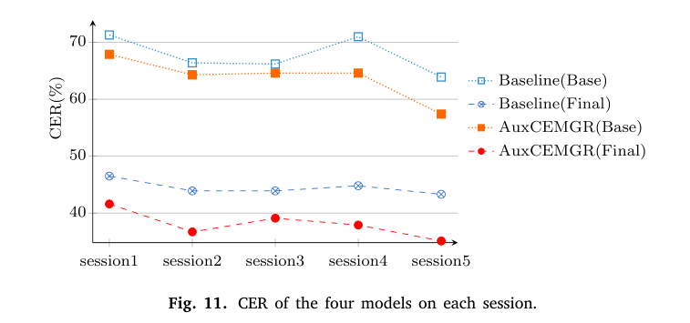

<div class="text-sm text-gray-400 mt-2 text-center">Fig.11 — 各 Session 的 CER 比較</div>

---

# 十七、訓練設定

<div class="grid grid-cols-2 gap-6 mt-4">
<div>

**Noam 暖機學習率排程器**

$$lr = d_{model}^{-0.5} \cdot \min(step^{-0.5},\ step \cdot warmup^{-1.5})$$

- warmup = 4000 步（線性升高）
- 之後按 step^(-0.5) 緩慢下降

比喻：爬山先慢走確認方向，接近山頂再放慢

<br>

**優化器：Adam**
- β₁=0.9, β₂=0.98, ε=1e-9
- 結合 Momentum + RMSProp 優點

</div>
<div>

**其他超參數**

| 參數 | 值 |
|------|-----|
| Batch Size | 128 |
| Dropout | 0.1 |
| Warmup Steps | 4000 |
| 提前停止 | 連續 10 Epoch 不改善 |

<br>

**評估指標 CER**

$$CER = \frac{S + D + I}{N}$$

- S：替換，D：刪除，I：插入
- N：參考句子總字元數
- 計算工具：Levenshtein 距離

</div>
</div>

---
layout: two-cols
---

# 十八、主要實驗結果

<br>

**測試集 CER 比較**

| 模型 | CER |
|------|-----|
| Wadkins 2019 (LSTM+CTC) | 66.8% |
| Baseline 無增強 | 66.5% |
| Baseline 完整增強 | 44.5% |
| AuxCEMGR 無增強 | 62.5% |
| **AuxCEMGR 完整增強** | **38.0%** ⭐ |

<br>

**關鍵結論**
- 單純加輔助任務（無增強）：反而比 Baseline 差
- 增強 + 輔助任務合用：效果最佳
- 比 Wadkins 2019 改善 **28.8 個百分點**

::right::

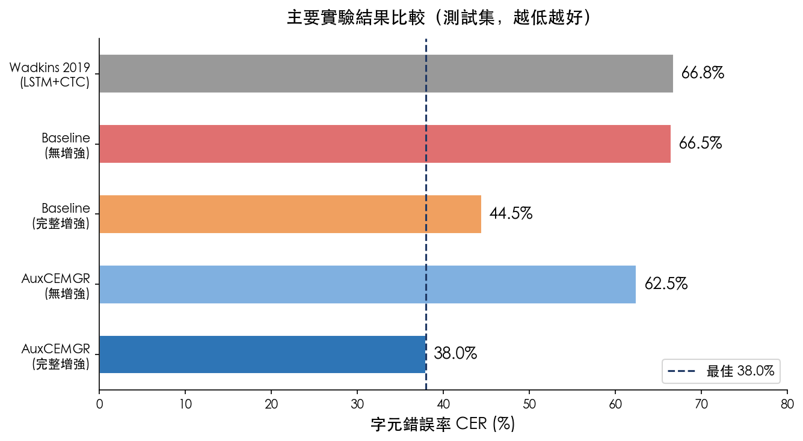

<div class="text-sm text-gray-400 mt-2 text-center">主要結果橫條圖（越低越好）</div>

---
layout: two-cols
---

# 十九、電極通道重要性（Fig.8）

<br>

**實驗方式**：每次只用 1 個通道，測 CER

<br>

**結果排名（重要性從高到低）**

| 通道 | 位置 | 相對重要性 |
|------|------|-----------|
| CH4 | 下巴右側 | ⭐⭐⭐⭐⭐ 最重要 |
| CH3 | 下巴左側 | ⭐⭐⭐⭐ |
| CH1,CH2 | 上嘴唇 | ⭐⭐⭐ |
| CH7,CH8 | 臉頰 | ⭐⭐ |
| CH5,CH6 | 喉部 | ⭐ 最不重要 |

<br>

**喉部最不重要的原因**：靜默說話時聲帶不振動，喉部肌肉幾乎不收縮

::right::

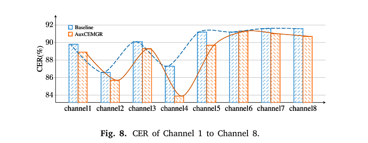

<div class="text-sm text-gray-400 mt-2 text-center">Fig.8 — 各通道單獨使用的 CER</div>

---
layout: two-cols
---

# 二十、句子長度 & 跨 Session 分析

<br>

**句子長度 vs CER（Fig.10）**
- 短句（5–10 字）：CER 較低
- 長句（20+ 字）：CER 大幅上升
- 原因：CTC 對齊難度增加，Beam Search 路徑爆炸
- 改善：加入語言模型（LM）輔助解碼

<br>

**跨 Session 分析（Fig.11）**
- Session 間 CER 差異最高達 ±10%
- GRL 輔助任務有效縮小差距

<br>

**有聲 vs 靜默 EMG（Fig.12）**
- 有聲訓練→靜默測試：CER 很高
- 靜默訓練→靜默測試：最佳（本研究方法）

::right::

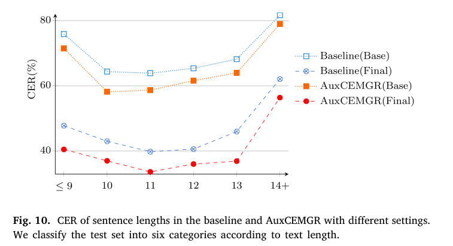

<div class="text-sm text-gray-400 mt-2 text-center">Fig.10 — 句子長度 vs CER</div>

---

# 二十一、結論

<div class="grid grid-cols-2 gap-6 mt-4">
<div>

**本研究貢獻**
- 第一個中文臉部 sEMG 無聲語音辨識系統
- 最佳測試集 CER = **38.0%**
- 三種增強 + 兩個輔助任務，各自都有貢獻

**研究限制**
- 只有 1 名受試者
- NBA 特定語料庫
- CER 38% 仍高，實用化還有距離

</div>
<div>

**未來研究方向**

1. 多受試者跨人辨識
2. 加入語言模型解碼
3. 擴充語料庫（方言、日常對話）
4. 硬體微型化（可穿戴式）
5. 多模態融合（sEMG + 視訊）
6. 即時推論優化

</div>
</div>

---

# 二十二、實驗復現快速指南

<div class="grid grid-cols-2 gap-4 mt-4">
<div>

```python
# 環境安裝
pip install torch librosa scipy numpy jiwer

# Step 1：訊號前處理
from scipy.signal import butter, filtfilt, iirnotch
b, a = butter(4, [10, 400], btype='band', fs=1000)
x = filtfilt(b, a, raw)
for f0 in [50, 150, 250, 350]:
    b, a = iirnotch(f0, Q=30, fs=1000)
    x = filtfilt(b, a, x)

# Step 2：MFSC 特徵萃取
import librosa
mel = librosa.filters.mel(sr=1000, n_fft=25, n_mels=36)
mfsc = librosa.feature.melspectrogram(
    y=x, sr=1000, n_mels=36, hop_length=10)
```

</div>
<div>

```python
# Step 3：模型建立（PyTorch）
import torch.nn as nn

class AuxCEMGR(nn.Module):
    def __init__(self):
        super().__init__()
        self.cnn = nn.Sequential(
            nn.Conv2d(8, 256, 3, stride=2),
            nn.Conv2d(256, 256, 3, stride=2))
        enc = nn.TransformerEncoderLayer(
            d_model=256, nhead=8, dropout=0.1)
        self.transformer = nn.TransformerEncoder(enc, 6)
        self.ctc_char   = nn.Linear(256, 667+1)  # +blank
        self.ctc_pinyin = nn.Linear(256, 63+1)
        self.session_cls = nn.Linear(256, 5)  # 5 sessions

# Step 4：訓練
# Adam + Noam(warmup=4000) + Batch=128
# L = L_ctc + 1.0*L_pinyin + 1.0*L_session(GRL)
```

</div>
</div>
